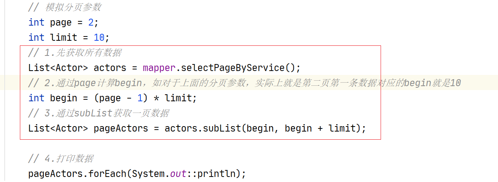
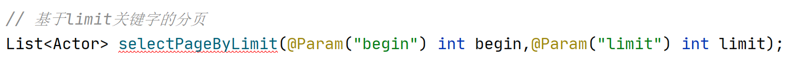
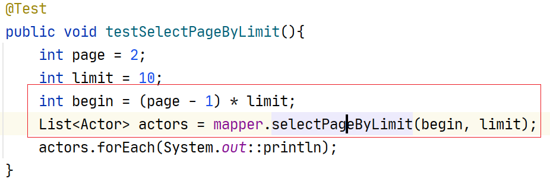
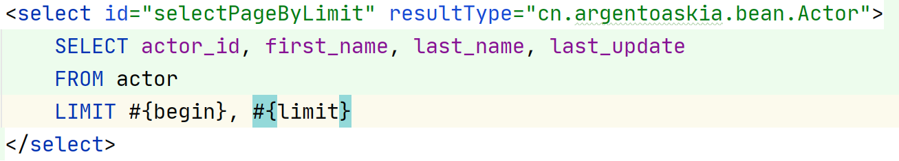
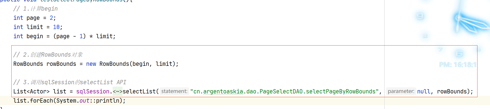
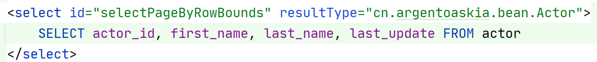
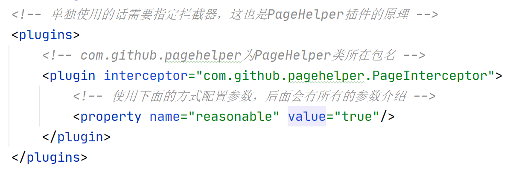
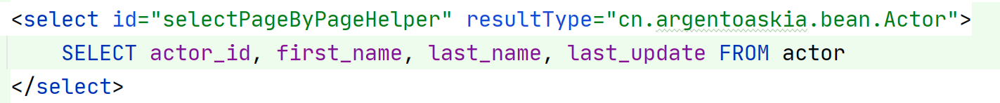
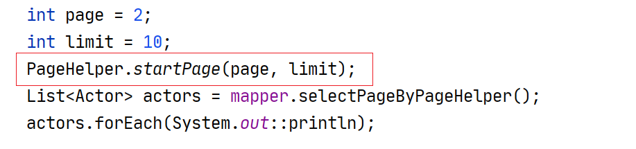

## Mybatis中常见的分页实现

在`Mybatis`中常见的分页实现大概有4种：

- 业务逻辑分页
- `LIMIT`关键字
- `RowBounds`分页
- `PageHelper`插件实现（拦截器实现）

在分页之前先介绍两个东西，首先一般分页，前端都会带着两个参数过来，即所谓的`page`参数（代表当前请求的页）和`limit`参数（每页多少条数据），但是在后端代码中，`limit`参数还好，靠`page`参数并不能直观地知道要从哪条数据开始拿起，打个比方说，现在我要取第二页，每页有10条数据，那现在你取数据的时候是不是要跳过第一页的那10条，从第11条数据开始取，这个11的数据一般也叫`Begin`参数。

具体`Page`参数转`Begin`参数的公式：`begin = （page - 1）* limit`，因为一般`begin`的计算从`0`开始

### 业务逻辑分页

业务逻辑分页的要求是在业务层中对数据进行分页即可，通常`DAO`层可以查询所有的数据，然后在业务层通过转换页数（Page）到下标值（Begin）来实现分页，核心代码在业务层：

1. 先查询全部数据
2. 计算出`begin`值
3. 获取列表的子列表即可

### 基于Limit关键字的写法

像`MySQL`数据库一般有内置的部分数据返回关键字`LIMIT`，其原理和业务层分页大差不差。不过`begin`参数和`Limit`参数需要传递给`DAO`层，因此接口需要这样设计：

核心代码如下：

### 基于RowBounds的分页

基于`RowBounds`的分页可能会比较复杂，早期`ibatis`时代，并没有所谓的`mapper`之说，很多查询都要调用`sqlSession`的原生`api`来进行，这种分页也是一种巧妙的解决方法，大概步骤如下：

1. 计算`begin`值
2. 传入`begin`值和`limit`参数创建`RowBounds`对象
3. 调用`SqlSession`的查询`API`来进行查询并传入`RowBounds`对象

核心代码：

其中`cn.argentoaskia.dao.PageSelectDAO.selectPageByRowBounds`是对象要查询的`DAO`接口，其`SQL`语句是查询全部的数据：

这种方式比较适合用在小数据量查询

### 基于PageHelper实现

[官方主页](https://pagehelper.github.io/docs/)

使用`PageHelper`插件，可以非常容易地进行分页查询，底层原理利用了`Mybatis`的拦截器，使用步骤如下：

1. 需要在`mybatis-config.xml`中配置拦截器，拦截器本身支持设置`properties`，具体有哪些可以参考[这里](https://pagehelper.github.io/docs/howtouse/)的第三点。

2. `DAO`接口只需查询所有数据

3. 在**调用**`DAO`**接口之前先开启分页**，开启分页的方法很多~~（常见就是`PageHelper.startPage(page,limit)`，因为它简单）~~，见[这里](https://pagehelper.github.io/docs/howtouse/)的**第三大点**。

`ok`，上面就是常见的分页实现，如果从多数据库的角度来看的话，推荐程度是：

> PageHelper > RowBounds >= 业务逻辑 > Limit关键字（MySQL限定）

