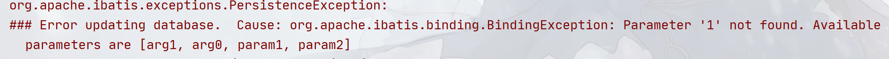

## mybatis-2-3-parameters

本章主要介绍`DAO`接口的参数传递给`Mapper`的几种方式，在`mybatis`中参数一般有下面几个类型：

- 基本类型、`String`、包装器类这些归为一类
- 引用类型
- `Map`

因此这些分类大概有`9`种组合。

在使用`JDBC`时候，都知道`Statement`一般会有两种：`statement`和`PreparedStatement`，其中`PreparedStatement`一般用于预处理的符号`?`（也叫占位符）的`SQL`语句，在`mybatis`中，处理`SQL`语句默认也是采用`PreparedStatement`（如果希望更改`SQL`执行器类型，可以指定`statementType`属性），但`mybatis`提供了一种新的占位符。

### mybatis的占位符

这里有一个非常简单的`DAO`接口：

```java
public interface ActorDAO{
    Actor selectById(Integer id);
}
```

非常简单的`DAO`，在`PreparedStatement`时代，这个`DAO`对应的`SQL`语句一般这样写：

```sql
SELECT * FROM actor where actor_id = ?
```

然后还需要编写者自己使用`preparedStatement.setXXX();`方法来填入参数。

在`mybatis`中就没有这么麻烦了，在`mybatis`中的占位符`#{}`可以让你省区调用烦人的`setXXX()`

例如上面的`DAO`，换成`Mapper`应该是这样写：

```xml
<select id="selectById" resultType="...">
    SELECT * FROM actor where actor_id = #{id}
</select>
```

注意看到那个`#{id}`了吗，在`mybatis`中这样就可以指定传递给`SQL`的参数，`#{}`里面的内容对应的是`DAO`中方法参数的参数名。

有意思的是，`#{}`内的内容理论上不能是参数名，如果我们的`DAO`接口需要传递多个参数，如：

```java
public interface ActorDAO{
    Actor[] selectByFullName(String firstName, String lastName);
}
```

 这个时候如果我们再像上面的这种写法：

```xml
<select id="selectById" resultType="...">
    SELECT * FROM actor where actor_first_name = #{firstName} AND actor_last_name = #{lastName} 
</select>
```

将会抛出异常，显示类似于下面的提示信息：



这种情况下你可以按照抛出的信息来将`#{}`的内容替换成可以使用的参数，如：`paramX`（`X`代表数字），`argX`（同理），这些都是代表参数的下标序号，如在这里的话，`param1`、`arg0`就代表`firstName`参数，`param2`、`arg1`就代表`lastName`参数。

但是显然上面的两种方式都不是最直观的，更加通用准确的方式是使用`mybatis`提供的`@Param`注解来给参数命名，如：

```java
public interface ActorDAO{
    Actor[] selectByFullName(
        @Param("firstName") String firstName, 
        @Param("lastName")  String lastName);
}
```

命名了之后再写`Mapper`的时候就可以这样写了：

```xml
<select id="selectById" resultType="...">
    SELECT * FROM actor where actor_first_name = #{firstName} AND actor_last_name = #{lastName} 
</select>
```

这里可能会有人疑惑！类似于`SpringMVC`等框架，他们都能通过判断参数名来实现`QueryString`的映射，`mybatis`却不行？

其实原因很简单，首先`Java`反射`API`中`Parameter`类中`getName()`方法不能直接获取到参数名，默认情况下都是返回类似于`arg0`、`arg1`这样的代表参数位置的字符串，如果需要能够获取参数名，则必须要有下面两个条件：

- 必须是`JDK8`以上，包括`JDK8`
- 编译类的时候加上`-parameter`参数

这两个条件同时满足时，才能够真正获取到方法的参数名。相关章节可以跳转到这里查看。

其次，部分未基于`JDK8`的`Spring`也能获取参数名，那是因为`Spring`使用字节码框架（如：`ASM`）分析字节码来完成的获取，这种方式没有`JDK8`版本的限制，只要在编译时加上`-g`参数即可。但是这种方式对类有效，对接口无效，好死不死我们的`DAO`就是接口。

在处理接口方法参数的时候，想要获取方法参数，现阶段除了满足上面的反射`API`的两个条件获取之外，没有任何方法。

因此从另外一个角度讲，不是`mybatis`不想做，而是反射`API`限制下只能作出妥协。

----

另外还有一个问题，那为什么只有单个参数的时候就可以通过参数名来获取参数？

实际上`mybatis`并没有获取参数名，因为是单参数，所以无论`#{}`里面写什么东西，参数永远也只有一个，因此，就算你改成这样也是没问题的：

```xml
<select id="selectById" resultType="...">
    SELECT * FROM actor where actor_id = #{123}
    <!-- 这里从id变成了123，但是代码也能运行 -->
</select>
```

这是因为当`DAO`接口方法只有一个参数的时候，`mybatis`会生成一个`_parameter`来代替这个参数，因此你甚至可以这样写：

```xml
<select id="selectById" resultType="...">
    SELECT * FROM actor where actor_id = #{_parameter}
</select>
```

因为参数只有一个，所以`#{}`里面写什么内容都是可以的，反正都会关联上。

废话有点多了，这里总结一下：

1. `mybatis`中使用`#{}`作为占位符，相当于`PreparedStatement`中的`?`
2. 当参数只有一个的时候，`mybatis`会为这个参数生成一个`_parameter`作为标识，并且这个时候`#{}`里面写任何内容都可以映射上。
3. 当参数存在多个的时候，有三种解决方法。
   1. 采用`@Param`注解给参数起别名（推荐，也是比较通用的方法）
   2. 采用`paramX`来占位，`X`从`1`开始
   3. 采用`argX`来占位，`X`从`0`开始

### mybatis中各种类型参数传递

前面介绍过了，在`mybatis`中传递的参数类型大概有三种：字面类型（包括基本类型、包装器类、`String`）、引用类型、`map`。而其中，`mybatis`的占位符使用又分单参数和多参数的情况，因此这两组合在一起就会出现很多参数传递场景。

理论上无论哪种常见，`@Param`都是最通用的方法。

#### 单参数 + 字面类型

这种传递形式前面有介绍过，

#### 单参数 +  引用类型

#### 单参数 + map

#### 多参数 + 字面类型 + 字面类型

#### 多参数 + 字面类型 + 引用类型或map

#### 多参数 + 引用类型 + 引用类型

#### 多参数 + 引用类型 + map

