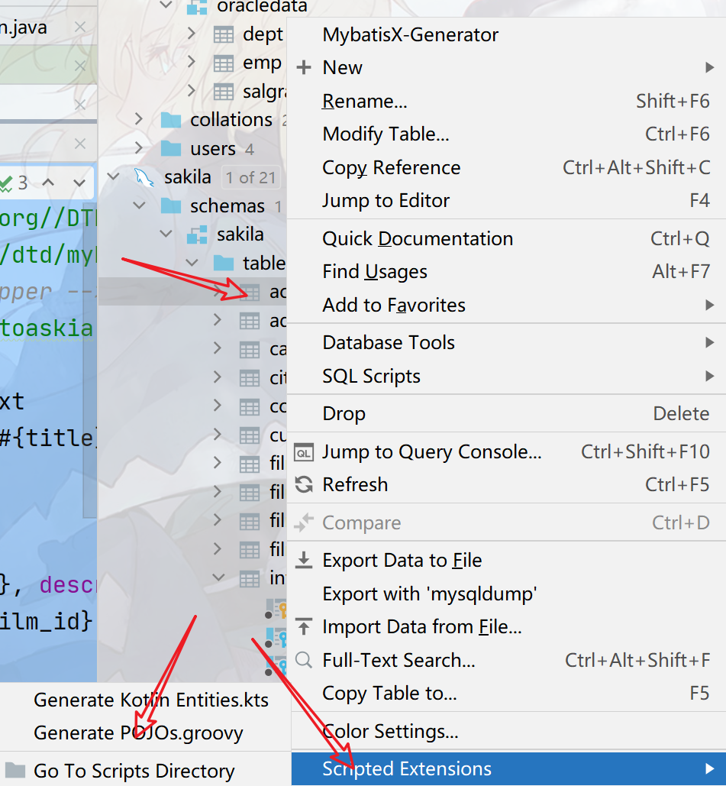
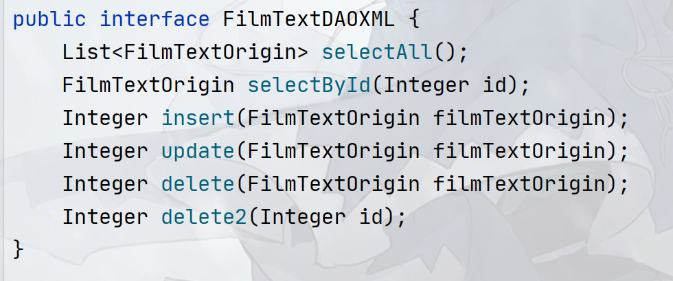
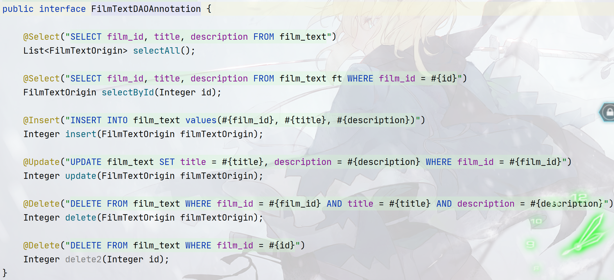
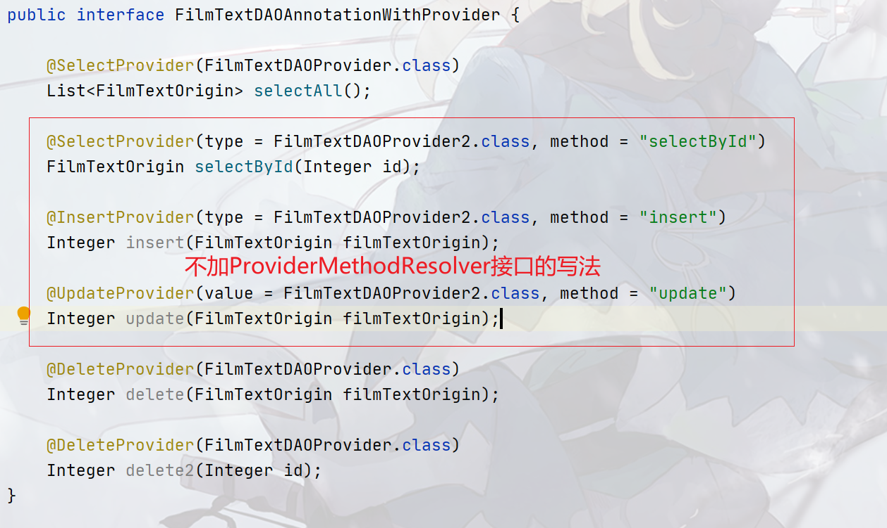

## mybatis-2-2-mybatis-crud-with-java-xml

本篇主要介绍并对比`mybatis`三种基本的`CRUD`方式：

- 基于`XML`的`CRUD`
- 基于注解的`CRUD`
- 基于`Java` `Provider`代码的`CRUD`

其中最常用的是前面两种，个人感觉第三种用法也挺好用的。

特别注意：本章节配置的是`Mybatis`的`Mapper`文件，也就是写`SQL`的地方，而`mybatis-config`文件是配置`Mybatis`框架的地方！区别开来！

无论哪种配置方式都需要先配置好`Mybatis-config`！因为`Mybatis-config`里面有一个`Mappers`标签，用于告诉`Mybatis`，`mapper`文件的位置，如果不指定的话，`Mybatis`框架无法，具体这个属性的配置方法可以参考这里，为了省时间，简单说明下：

目录结构

如果是基于`XML`的`Mapper`配置方式：则`Mapper`标签可以这样写：

```xml
<!-- resource写法通用，写mapper的xml位置 -->
<mapper resource="cn/argentoaskia/dao/FilmTextDAOXMLMapper.xml"/>
<!-- 
如果写DAO接口的全限定类名的话则要求对应的FilmTextDAOXMLMapper.xml要和FilmTextDAOXML同包同名，
如这两个文件的位置：
FilmTextDAOXML.java: src/main/java/cn/argentoaskia/dao/FilmTextDAOXML.java
FilmTextDAOXMLMapper.xml:名字要改成FilmTextDAOXML.xml，并且放在：src/main/resources/cn/argentoaskia/dao/FilmTextDAOXML.xml
-->
<mapper class="cn.argentoaskia.dao.FilmTextDAOXML"/>
```

如果是基于注解的`Mapper`和`Provider`的配置，则只需要些写`class`即可，如：

```xml
<mapper class="cn.argentoaskia.dao.FilmTextDAOAnnotation"/>
<mapper class="cn.argentoaskia.dao.FilmTextDAOAnnotationWithProvider"/>
```

## 基于XML的配置方式

基于`XML`的配置方式实现基本的`CRUD`，你需要提供：

- 实体类
- `DAO`接口（`interface`）
- `Mapper.xml`文件

你可以参考模块：`mybatis-2-2-mybatis-crud-with-java-xml`中的这几个类和文件，他们分别对应上面的三大块：

- `cn.argentoaskia.beans.FilmTextOrigin`实体类
- `cn.argentoaskia.dao.FilmTextDAOXML`接口
- `src/main/resources/cn/argentoaskia/dao/FilmTextDAOXMLMapper.xml`接口对应的`Mapper`

测试代码在：`src/test/java/cn/argentoaskia/dao/FilmTextDAOXMLTest.java`

----

首先定义一个实体，这里没啥好说的，如果配置了`Idea`的`Database`（一般在右边工具栏），那你可以在那里选中你要的表，右键选中`Scripted EXtensions`，选中`Generate POJOs.groovy`生成实体类。



`DAO`接口中只需要定义基本的查询即可。如：



上面的接口定义了基本的`CRUD`方法，查询全部，主键唯一查询，插入，删除，修改等。

那么重点就在这个`Mapper`文件的编写了，一般情况下，`Mapper`文件的内容都是根据`DAO`接口来的，`Mapper`文件的框架如下：

```xml
<!DOCTYPE mapper
        PUBLIC "-//mybatis.org//DTD Mapper 3.0//EN"
        "http://mybatis.org/dtd/mybatis-3-mapper.dtd" >
<!-- 基本CRUD,XML形式配置——Mapper -->
<mapper namespace="$END$">
    
</mapper>
<!-- 同样可以把这个做成live template -->
```

其中`namespace`属性指定的是`DAO`接口的全限定类名，一般在`idea`中选中类右键，`copy`，`copy Reference`即可。

在`mapper`标签下，根据`SQL`语句的类型，分了四个小标签，分别代表增删改查的`SQL`：

- `select`标签：代表`select`语句
- `insert`标签：代表`insert`语句
- `delete`标签：代表`delete`语句
- `update`标签：代表`update`语句

如上面的`DAO`接口，在`Mapper`中就可以这样写：

```xml
<!DOCTYPE mapper
        PUBLIC "-//mybatis.org//DTD Mapper 3.0//EN"
        "http://mybatis.org/dtd/mybatis-3-mapper.dtd" >
<!-- 基本CRUD,XML形式配置——Mapper -->
<mapper namespace="cn.argentoaskia.dao.FilmTextDAOXML" >
    <select id="selectAll" resultType="cn.argentoaskia.beans.FilmTextOrigin">
        SELECT film_id, title, description
        FROM film_text
    </select>
    <!-- 其他标签暂省略 -->
</mapper>
```

其中`id`代表`DAO`接口的方法名，`resultType`代表返回值类型或者返回值类型的原始类型（数组、`List`、`Set`等则只需要填写其对应的类型就好，一般这个类型叫原始类型）。这些属性都会在这个章节里面有介绍。

上面的`DAO`接口完整的`Mapper`长这样：

```xml
<!DOCTYPE mapper
        PUBLIC "-//mybatis.org//DTD Mapper 3.0//EN"
        "http://mybatis.org/dtd/mybatis-3-mapper.dtd" >
<!-- 基本CRUD,XML形式配置——Mapper -->
<mapper namespace="cn.argentoaskia.dao.FilmTextDAOXML" >
 	<select id="selectAll" resultType="cn.argentoaskia.beans.FilmTextOrigin">
        SELECT film_id, title, description
        FROM film_text
    </select>
    
    <select id="selectById" resultType="cn.argentoaskia.beans.FilmTextOrigin">
        SELECT film_id, title, description
        FROM film_text
        WHERE film_id = #{id}
    </select>
    
    <insert id="insert">
        INSERT INTO film_text
        VALUES(#{film_id}, #{title}, #{description})
    </insert>
    
    <update id="update">
        UPDATE film_text
        SET title = #{title}, description = #{description}
        WHERE film_id = #{film_id}
    </update>
    
    <delete id="delete">
        DELETE FROM film_text
        WHERE film_id = #{film_id} AND
              title = #{title} AND
              description = #{description}
    </delete>
    
    <delete id="delete2">
        DELETE FROM film_text
        WHERE film_id = #{id}
    </delete>
</mapper>
```

## 基于注解的配置方式

基于注解的方式则无需要写具体的`Mapper`，可以当作`Mapper`和`DAO`放在同一个地方了，只需要在DAO接口方法上标记相应的注解即可。

- `SELECT`语句：`@Select`
- `INSERT`语句：`@Insert`
- `UPDATE`语句：`@Update`
- `DELETE`语句：`@Delete`

基于注解形式的配置只需要在接口方法上标记注解，在注解里面写`SQL`即可，如：


## 基于Provider的配置方式

`mybatis`的使用原则上了解前面两种配置方式就够了，但是为了满足一些特殊的要求，但当你需要对返回的结果进行一些自己的处理，比如作筛选或者一些名称的替换等，则可以采用这种配置方式。

在`Mybatis`中，有一个接口叫`ProviderMethodResolver`可以帮助更好地实现`Provider`的配置方式，当然也可以不用这个接口。

具体同样需要先定义一个`DAO`接口，如：

```java
public interface FilmTextDAOAnnotationWithProvider {

    List<FilmTextOrigin> selectAll();

    FilmTextOrigin selectById(Integer id);

    Integer insert(FilmTextOrigin filmTextOrigin);

    Integer update(FilmTextOrigin filmTextOrigin);

    Integer delete(FilmTextOrigin filmTextOrigin);

    Integer delete2(Integer id);
}
```

然后你需要再编写一个`Provider`类，这个类相当于`mapper`，你需要在这个类里面所有的方法返回一个字符串，代表`SQL`语句：

```java
public class FilmTextDAOProvider implements ProviderMethodResolver {

    // SELECT film_id, title, description FROM film_text
    public String selectAll() {
        return new SQL(){
            {
                SELECT("film_id", "title", "description");
                FROM("film_text");
            }
        }.toString();
    }

    // SELECT film_id, title, description FROM film_text ft WHERE film_id = #{id}
    public String selectById(Integer id) {
        return new SQL(){
            {
                SELECT("film_id", "title", "description");
                FROM("film_text");
                WHERE("film_id = #{id}");
            }
        }.toString();
    }

    // INSERT INTO film_text values(#{film_id}, #{title}, #{description})
    public String insert(FilmTextOrigin filmTextOrigin) {
        return new SQL(){
            {
                INSERT_INTO("film_text");
                INTO_VALUES("#{film_id}", "#{title}", "#{description}");
            }
        }.toString();
    }

    // UPDATE film_text SET title = #{title}, description = #{description} WHERE film_id = #{film_id}
    public String update(FilmTextOrigin filmTextOrigin) {
        return new SQL(){
            {
                UPDATE("film_text");
                SET("title = #{title}", "description = #{description}");
                WHERE("film_id = #{film_id}");
            }
        }.toString();
    }

    // DELETE FROM film_text WHERE film_id = #{film_id} AND title = #{title} AND description = #{description}
    public String delete(FilmTextOrigin filmTextOrigin) {
        return new SQL(){
            {
               DELETE_FROM("film_text");
               WHERE("film_id = #{film_id}").AND();
               WHERE("title = #{title}").AND();
               WHERE("description = #{description}");
            }
        }.toString();
    }

    // DELETE FROM film_text WHERE film_id = #{id}
    public String delete2(Integer id) {
        return new SQL(){
            {
                DELETE_FROM("film_text");
                WHERE("film_id = #{id}");
            }
        }.toString();
    }
}
```

这个`Provider`类的编写涉及到`Mybatis`的`SqlBuilder API`，也就是那个`new SQL()`，类似于在Java代码里面写`Sql`，很方便的。这个在后面介绍`Mybatis`的`Api`的时候会和大家说明，当然大家也可以参考下`Mybatis`中文网：[传送门](https://mybatis.org/mybatis-3/zh/statement-builders.html)

这个`Provider`类也可以不实现`ProviderMethodResolver`接口：

```java
public class FilmTextDAOProvider2 {

    // SELECT film_id, title, description FROM film_text
    public String selectAll() {
        return new SQL(){
            {
                SELECT("film_id", "title", "description");
                FROM("film_text");
            }
        }.toString();
    }

    // SELECT film_id, title, description FROM film_text ft WHERE film_id = #{id}
    public String selectById(Integer id) {
        return new SQL(){
            {
                SELECT("film_id", "title", "description");
                FROM("film_text");
                WHERE("film_id = #{id}");
            }
        }.toString();
    }

    // INSERT INTO film_text values(#{film_id}, #{title}, #{description})
    public String insert(FilmTextOrigin filmTextOrigin) {
        return new SQL(){
            {
                INSERT_INTO("film_text");
                INTO_VALUES("#{film_id}", "#{title}", "#{description}");
            }
        }.toString();
    }

    // UPDATE film_text SET title = #{title}, description = #{description} WHERE film_id = #{film_id}
    public String update(FilmTextOrigin filmTextOrigin) {
        return new SQL(){
            {
                UPDATE("film_text");
                SET("title = #{title}", "description = #{description}");
                WHERE("film_id = #{film_id}");
            }
        }.toString();
    }

    // DELETE FROM film_text WHERE film_id = #{film_id} AND title = #{title} AND description = #{description}
    public String delete(FilmTextOrigin filmTextOrigin) {
        return new SQL(){
            {
                DELETE_FROM("film_text");
                WHERE("film_id = #{film_id}").AND();
                WHERE("title = #{title}").AND();
                WHERE("description = #{description}");
            }
        }.toString();
    }

    // DELETE FROM film_text WHERE film_id = #{id}
    public String delete2(Integer id) {
        return new SQL(){
            {
                DELETE_FROM("film_text");
                WHERE("film_id = #{id}");
            }
        }.toString();
    }
}
```

最后在`DAO`接口中，加上一个`@XXXProvider`注解：

- `SELECT`语句：`@SelectProvider`
- `INSERT`语句：`@InsertProvider`
- `UPDATE`语句：`@UpdateProvider`
- `DELETE`语句：`@DeleteProvider`



如果实现了`ProviderMethodResolver`接口的话，则只需要指定`Provider`类的`class`对象即可，`Mybatis`会根据`DAO`接口方法的方法名来匹配对应的`Provider`类的方法，`Provider`类和`DAO`接口中同名的方法将会绑定在一起。

不实现`ProviderMethodResolver`接口，或者`Provider`类中方法名和`DAO`接口中的不一致的时候，则需要在`@XXXXProvider`注解中**额外指定**`method`**属性作为绑定**。