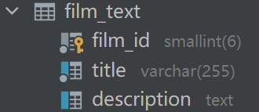
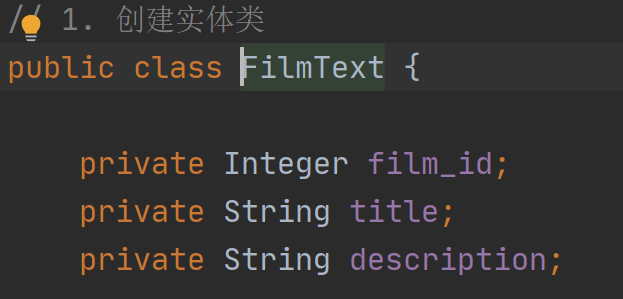
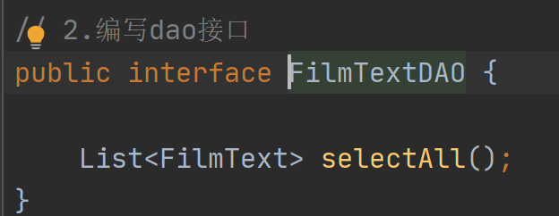
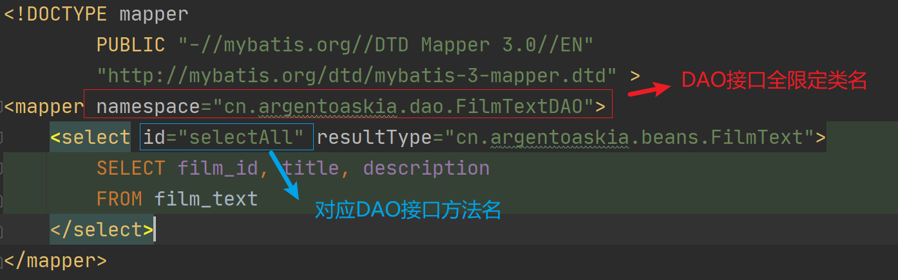
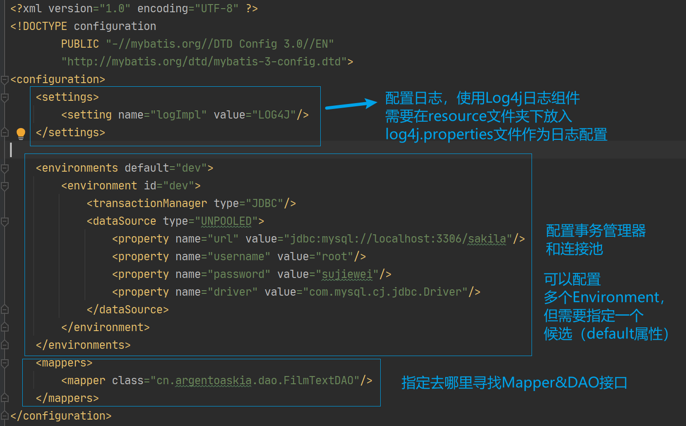
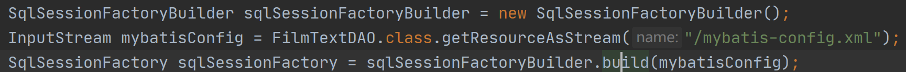
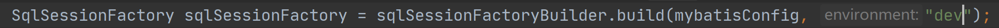
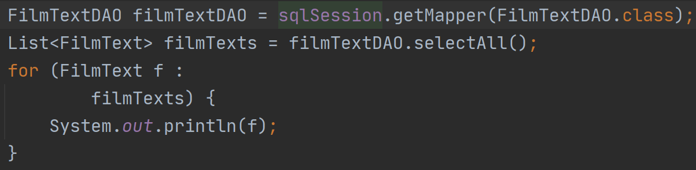

## mybatis-1-simple-start

文章主要简单介绍下`mybatis`框架的入门使用，旨在帮助快速上手框架。

`mybatis`作为一个`ORM(Object Relational Mapping,对象关系映射)`框架，需要和`Java`对象打交道（将查询出来的数据封装成`Java`对象的形式），负责`web`开发中的`DAO`层（`DAO`接口）。

### 1.框架快速上手

要想使用`mybatis`框架，必须现有四大件：

- [x] 实体类
- [x] `DAO`接口
- [x] 框架配置（`XML`文件）：一般指所谓的`mybatis-config.xml`，用来配置`mybatis`框架（如：配置连接池、框架日志配置、`Mapper`文件位置等）
- [x] `Mapper`配置（`XML`文件）：专门给开发者编写`SQL`语句的地方，一般会和`DAO`接口通过`namespace`属性绑定在一起，形成一个`DAO`接口一个`Mapper`的基本局面。

#### 1.定义实体类

本次`demo`采用的是`MySQL`自带的实例数据库`Sakila`中的`film_text`表。

这个表只有三个字段：



因此在定义实体类的时候，可以这样定义：



同时生成相关的`Setter`、`Getter`方法和`toString`方法。

#### 2.创建DAO接口

创建`FilmTextDAO`并编写一个简单的`selectAll()`方法



#### 3.创建并编写Mapper文件（FilmTextDAOMapper.xml）



#### 4.编写mybatis配置文件（mybatis-config.xml）



### 2.框架测试

测试该框架，需要使用到`mybatis`的`API`，涉及到的类有如下：

- `SqlSessionFactoryBuilder`：用于创建`SqlSessionFactory`。
- `SqlSessionFactory`：用于创建`SqlSession`。
- `SqlSession`：用于获取`DAO`接口实现类。

首先需要初始化一个`SqlSessionFactory`，代表一套环境。初始化你需要先创建

`SqlSessionFactoryBuilder`，通过`SqlSessionFactoryBuilder`类的`build()`来创建，创建过程中还需要传递`mybatis`配置文件给方法以用来初始化框架。

关于`build()`，它有几个重载体：

```java
// 使用Configuration类进行配置，参考代码方式创建。
public SqlSessionFactory build(Configuration config);

// 传递mybatis-config.xml的字符流来创建
public SqlSessionFactory build(Reader reader);
public SqlSessionFactory build(Reader reader, String environment);
public SqlSessionFactory build(Reader reader, Properties properties);
public SqlSessionFactory build(Reader reader, String environment, Properties properties);

// 传递mybatis-config.xml的字节流来创建
public SqlSessionFactory build(InputStream inputStream);
public SqlSessionFactory build(InputStream inputStream, String environment);
public SqlSessionFactory build(InputStream inputStream, Properties properties);
public SqlSessionFactory build(InputStream inputStream, String environment, Properties properties);
```

看到上面的重载体之后，就可以得出创建`SqlSessionFactory`的代码了：



特别主要，在创建过程中，如果你的`mybatis-config.xml`中存在多套环境，你还可以指定`String environment`来使用具体的环境（具体后面介绍框架配置文件元素的时候也会细🔒），如下面的代码。



然后，你需要获取`SqlSession`对象，获取`SqlSession`对象也很简单，只需要通过`sqlSessionFactory.openSession()`即可获得。


最后，通过`SqlSession`的`getMapper()`方法，指定`DAO`接口的`Class`对象获取`DAO`接口的代理对象，然后执行相关查询即可。



